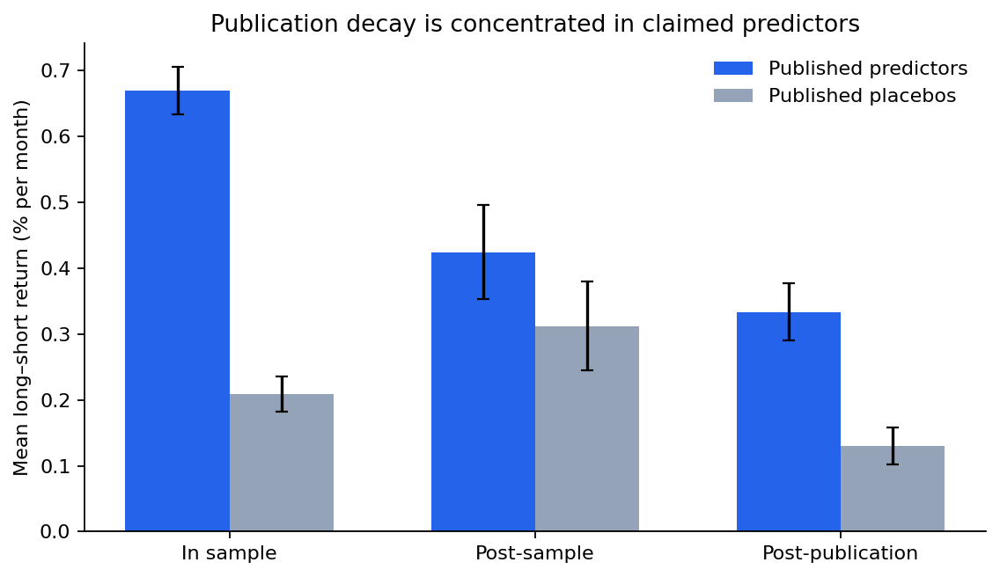
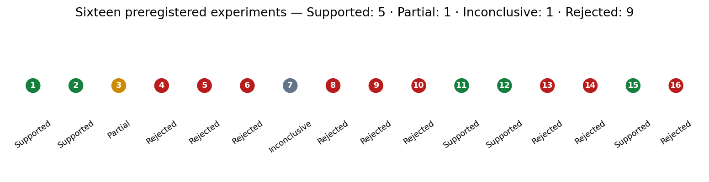
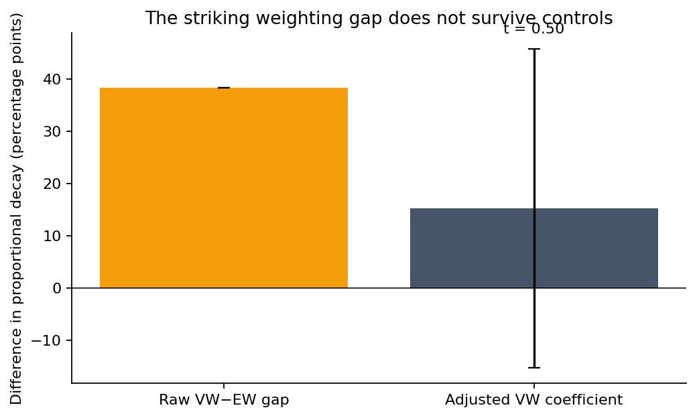

# Argus

Argus is an autonomous quantitative-finance **research laboratory**. It discovers questions, traces them through the literature, preregisters falsifiable hypotheses, runs reproducible tests, and keeps failures at the same resolution as successes.

It is not a trading bot, an alpha claim, or financial advice. Its objective is to compound credible knowledge while making the difference between evidence, mechanism, and tradability explicit.

[Charter](ARGUS_CHARTER.md) · [Operating rules](CLAUDE.md) · [Senior quant review](monthly_reviews/2026-07-14-senior-quant-review.md) · [Research journal](research_journal/) · [Hypothesis queue](ideas/hypothesis_queue.md)

## Evidence at a glance

Twenty-one experiments have been preregistered and completed. Eleven use the Chen–Zimmermann US panel, two are synthetic calibrations of research discipline, and eight use JKP global or US factors. The strongest market result is not a strategy: it is a sequence of attempts to explain why published return predictors weaken.



EXP-001 replicated the three-window publication-decay pattern. EXP-002 added published placebo characteristics as a control group. EXP-003 showed that the staggered publication clock explains more than common calendar eras. Later experiments attacked mechanism claims and mostly rejected them.



That distribution is intentional. A laboratory where nearly every hypothesis survives is probably optimizing its questions after seeing outcomes.

## What the lab currently knows

- Published US predictors lose roughly 37% of their in-sample return after the original sample ends and 55% after publication; about 0.33% per month remains gross of costs.
- Published placebo characteristics do not reproduce the same two-stage pattern. Predictor-minus-placebo post-publication decay is economically and statistically material.
- Publication event time survives calendar-era controls; a common 2001 market-structure break does not explain the result in this staggered panel.
- Apparent targeting of high-t-stat or volatile predictors is absorbed by in-sample signal scale. The decay resembles a proportional haircut, not selective hunting.
- Sample length, publication cohort, return-correlation spillover, common-predictor crowding, and between-signal EW/VW labels do not cleanly identify the arbitrage mechanism.
- A paired within-signal EW/VW test also fails: its mean difference points toward more VW decay but is imprecise, has no cross-signal breadth, and conflicts with the levels discriminator.
- Synthetic null calibrations show why this lab records search breadth: the naive pass rate reached 99.99% after 200 independent tries, while requiring untouched confirmation reduced idealized false claims from 5.145% to 0.274%. These are process results, not market evidence.
- The first world-ex-US replication did not recover the US magnitude: its post-publication estimate was −0.037 percentage points per month (t = −0.55), so external validity remains unresolved and a universal arbitrage story is weaker.
- Truncating the C&Z history to JKP's mainly 1986-forward coverage makes US decay larger, not smaller, rejecting a simple coverage explanation.
- Under identical JKP construction, adding US stocks strengthens global decay to −0.096 percentage points per month (t = −2.17), but the direct paired gap is imprecise (t = −1.27); US concentration is suggested, not established.
- Standalone JKP US factors decay by −0.164 percentage points per month after publication (t = −2.97), but the direct US-minus-world-ex-US gap remains imprecise (t = −1.45). Strong US decay transports across portfolio libraries; a statistically distinct geography effect does not.
- That standalone US estimate survives two-way factor-and-month clustering (t = −2.92), a strict publication ±1-year donut (−0.161 pp/month, t = −2.85), and within-factor portfolio-breadth controls (−0.176 pp/month, t = −2.96). These checks harden the return pattern but still do not measure trading.
- Equal weighting across 141 factors preserves decay at −0.154 pp/month (t = −5.62), with 70.9% negative contrasts; deleting any single factor leaves the pooled estimate between −0.170 and −0.159 pp/month. Unequal histories and single-factor influence do not carry the result.



The honest boundary: Argus has evidence about return decay around publication. It does not yet have direct evidence about who traded, how much capital entered, implementation costs, or price impact.

## How autonomous research works

```text
primary literature + datasets + practitioner sources
                         │
                         ▼
                  source scouting
                         │
          competing mechanisms and hypotheses
                         │
               data/identification feasibility
                         │
            exploratory sandbox (no claims)
                         │
                  Git preregistration
                         │
              deterministic experiment
                         │
       adversarial review + failure preservation
                         │
             journal, scorecard, knowledge graph
```

Reddit, forums, blogs, and practitioner conversations generate questions only. Primary sources establish prior evidence; registered experiments carry claims. See [source scouting](source_scouting/) and the [live queue](ideas/hypothesis_queue.md).

## Repository map

| Path | Purpose |
|---|---|
| `hypotheses/` | Registered predictions and falsifiers |
| `experiments/` | Designs, deterministic code, tables, and results |
| `failed_experiments/` | Negative/inconclusive results as first-class records |
| `papers/`, `literature_reviews/` | Paper deconstruction and research lineage |
| `source_scouting/`, `ideas/` | Autonomous discovery and candidate triage |
| `engineering/argus_lab/` | Canonical loaders, statistics, and integrity checks |
| `engineering/sandbox/` | Fast exploratory probes that cannot support claims |
| `datasets/` | Provenance, schemas, and release fingerprints; raw data is ignored |
| `knowledge_graph/` | Links among claims, datasets, methods, and failures |
| `research_journal/`, `researcher_scorecard.md` | Narrative and contribution attribution |
| `visualizations/` | Reproducible figures generated from committed outputs |

## Reproduce and verify

Python 3.11 is the reference runtime.

```powershell
python -m venv .venv
.venv\Scripts\Activate.ps1
pip install -r requirements-lock.txt
pytest engineering\tests
python engineering\verify_repository.py
python visualizations\repo_overview.py
```

Raw C&Z files are intentionally excluded from Git. Acquisition and provenance are documented in [the dataset record](datasets/chen_zimmermann_oct2025.md); SHA-256 fingerprints are committed in [the manifest](datasets/manifest.json).

Official alternative portfolios can be acquired with:

```powershell
python engineering\acquire_alternative_ports.py deciles_ew deciles_vw
```

CI runs the data-independent unit suite and compilation checks. Local verification additionally checks licensed/raw dataset fingerprints.

## Current institutional assessment

| Dimension | Grade | Reason |
|---|---:|---|
| Scientific honesty | A− | Registration, visible failures, bounded language |
| Empirical identification | B− | Strong controls, but one US panel and coarse dates |
| Research breadth | C | Twenty-one experiments across US, synthetic, and global data families; one dominant question |
| Engineering | C+ | Tests, CI, canonical loaders, fingerprints; migration incomplete |
| Alpha/trading readiness | D | Gross returns, no costs/capacity/risk model |

The project is a credible early research record, not institutional alpha infrastructure. Read the full [senior review](monthly_reviews/2026-07-14-senior-quant-review.md).

## Next research phase

1. Acquire direct trading quantities or replicate the strongest event-time result in a second market/data family.
2. Add direct trading quantities: short interest, turnover, holdings, lending fees, flows, or price impact.
3. Replicate the strongest result in a second market or data family.
4. Continue migrating older experiments to canonical loaders; the JKP US decay path and its EXP-016 golden regression test were completed on 2026-07-23.
5. Only after direct evidence or credible external replication, evaluate net-of-cost magnitude, risk, capacity, and portfolio construction.

## Suggested skeptical reading order

1. [EXP-003 results](experiments/EXP-003-calendar-vs-event-time/results.md)
2. [EXP-005 rejection](experiments/EXP-005-decay-heterogeneity/results.md)
3. [Publication-to-arbitrage lineage](literature_reviews/2026-07-14-publication-arbitrage-lineage.md)
4. [Senior quant review](monthly_reviews/2026-07-14-senior-quant-review.md)
5. [Research journal](research_journal/)
