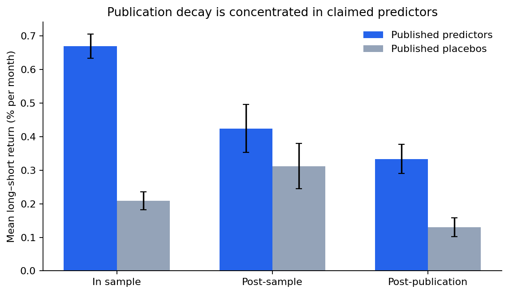
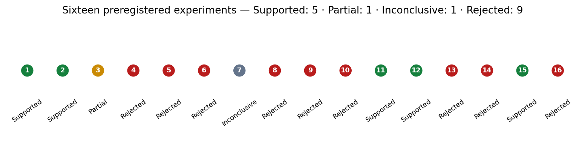

# Argus

Argus is an autonomous quantitative-finance **research laboratory**. It discovers questions, traces primary literature and data lineage, preregisters falsifiable hypotheses, runs deterministic tests, adversarially reviews the evidence, and preserves failures at the same resolution as successes.

It is not a trading bot, an alpha claim, or financial advice. Its objective is credible knowledge, reproducibility, and researcher learning. Statistical evidence, economic mechanism, and tradability remain separate promotion gates.

[Charter](ARGUS_CHARTER.md) · [Operating rules](CLAUDE.md) · [Agent guidance](AGENTS.md) · [Research journal](research_journal/) · [Hypothesis queue](ideas/hypothesis_queue.md) · [Researcher scorecard](researcher_scorecard.md)

## Current state — 2026-09-09

- **33 registered experiments completed.** The repository contains 21 failed/inconclusive experiment records and 12 surviving records; a surviving artifact is still bounded by its written identification limits.
- **Publication-decay evidence survives, mechanism evidence does not.** US predictors weaken after publication across two portfolio libraries and numerous robustness checks, but correlated-family concentration materially weakens breadth and there is no direct evidence of arbitrage capital, trading quantities, costs, or price impact.
- **Financial-genetics claims are rejected or paused.** EXP-025–029 found isolated properties of local mutation, diversity, and targeted repair, but no robust evolutionary or immune-controller advantage over equal-budget conventional alternatives.
- **The immune-system analogy produced one useful reframing.** The objective shifted from maximizing returns to preserving viable function subject to leverage/liquidity safety constraints.
- **EXP-031 separated surveillance from treatment.** Earlier boundary surveillance reduced invariant damage under both proportional and targeted responses. Targeting preserved 6–7 more units of healthy exposure but did not improve safety.
- **The external-data gate stopped the proposed financial-defense successor before registration.** The EBA 2025 release supplies real bank states and projected solvency outcomes, but no operational liquidity endpoint or empirical response from selective exposure cuts to later safety. A targeted intervention test would therefore be driven by researcher-imposed equations. Experiment numbers 032 and 033 now belong to the separate dependence-cluster audits.
- **The financial-defense branch is paused** pending an exogenous institutional intervention or an independently validated structural response model with untouched confirmation data.
- **Clinical-evidence pricing is at the exploration gate.** Prior work establishes large clinical-outcome reactions, but Argus has not shown predictability or delayed incorporation. A point-in-time event-ledger audit must precede any return test.
- **Two macro data gates are now resolved.** SPF supports a five-horizon point-disagreement design but not the proposed three-horizon density design. Three RTDSM targets share 129 quarterly vintages, while exact release-status mapping remains unfinished.

The latest decisions are documented in the [SPF schema audit](source_scouting/2026-09-09-spf-composition-schema-audit.md), [RTDSM vintage audit](source_scouting/2026-09-09-rtdsm-vintage-release-map-audit.md), and [clinical-evidence scouting audit](source_scouting/2026-08-21-clinical-evidence-mispricing.md).

## Evidence at a glance

### Publication decay: a return pattern, not a trading claim



The first 24 experiments develop and attack the publication-decay result:

- EXP-001 replicated the three-window pattern: published US predictors weaken after the original sample ends and weaken further after publication.
- EXP-002/003 added published placebos and staggered event-time controls; common calendar eras do not explain the pattern.
- EXP-004–010 tested spillovers, signal strength, sample length, cohorts, crowding, and equal- versus value-weighting mechanisms. The stronger mechanism stories mostly failed.
- EXP-011/012 calibrated research discipline: broad specification search creates extreme false-positive rates, while untouched confirmation sharply reduces idealized false claims. These are synthetic process results, not market evidence.
- EXP-013–016 tested transport across global and JKP data. Strong standalone US decay transports across portfolio libraries, while a statistically distinct US-versus-world geography effect remains imprecise.
- EXP-017–021 retained the US pattern under dependence-aware inference, publication-date donuts, breadth controls, equal factor weighting, and every single-factor deletion.
- EXP-022–024 overturned the earlier breadth interpretation. The 141 nominal factors contain only about 13 effective pre-publication correlation dimensions; equal-family inference fails, and one 59-factor family carries much of the equal-factor result.

The honest boundary is unchanged: Argus has evidence about gross return decay around publication. It does not yet identify who traded, how much capital entered, implementation costs, capacity, or causal price pressure.

### Financial genetics and immune-style defense

EXP-025–031 test the cross-disciplinary branch under explicit stop rules:

| Experiment | Narrow result | Classification boundary |
|---|---|---|
| EXP-025 | Local mutation helped in one synthetic transition | Joint recovery claim rejected; diversity collapsed |
| EXP-026 | A diversity reserve increased phenotype diversity | Adaptation did not improve; random restart won |
| EXP-027 | Environmental distance tracked designed severity | It did not predict when inheritance was valuable |
| EXP-028 | Localized mutation narrowly beat unrestricted mutation on one historical contrast | It did not reliably beat random restart and increased turnover |
| EXP-029 | Danger routing restored immune-like control structure | It beat no fixed response on the primary endpoint |
| EXP-030 | Targeted invariant restoration reduced collateral intervention | Timing and treatment were confounded; the joint claim failed |
| EXP-031 | Early surveillance reduced damage; targeting preserved healthy exposure | Targeting was not safer; the simulator is consumed |

The surviving formulation is deliberately non-biological:

```text
buffer-zone surveillance
        ↓
safety-constrained minimal intervention
        ↓
recovery while preserving viable function
```

The [EBA 2025 dataset audit](datasets/eba_2025_stress_test.md) inspected and fingerprinted 1,194,554 public observations across 64 banks. It improved external realism but failed the intervention-identification gate, so no financial-defense successor was registered.



Negative results are intentional outputs. A laboratory where nearly every hypothesis survives is probably adapting its questions or thresholds after seeing outcomes.

## Other active and paused programs

- **Macro-quant discovery:** the highest-ranked scouting path is a composition-robust inflation-disagreement curve, conditional on an SPF historical-schema audit. Real-time macro vintages are the parallel infrastructure candidate.
- **Publication mechanism:** the next claim-bearing priority is direct quantities—short interest, turnover, holdings, lending fees, flows, or price impact—or an external economic factor taxonomy.
- **Virtual economies / PLEX:** data reconstruction is preserved but paused under [research governance](research_governance/2026-08-03-plex-pause-and-genetics-quarantine.md). It is quarantined from financial-genetics design choices.
- **Financial defense:** paused after the EBA identification failure. Do not reuse EXP-030/031 paths or revive biological labels without a distinct falsifiable mechanism.
- **Clinical-evidence pricing:** exploratory point-in-time engineering is active; no HYP/EXP is registered and no return or alpha result exists.

The [live hypothesis queue](ideas/hypothesis_queue.md) is authoritative when this summary and a detailed artifact differ.

## How autonomous research works

```text
primary literature + versioned datasets + hypothesis-generating sources
                              │
                              ▼
                       source scouting
                              │
                 competing mechanisms and falsifiers
                              │
                  data and identification feasibility
                              │
                  exploratory sandbox — no claims
                              │
                      Git preregistration
                              │
                 deterministic registered experiment
                              │
             adversarial audit + full failure preservation
                              │
             journal + queue + scorecard + knowledge graph
```

Practitioner sources can nominate questions but cannot establish evidence. Registration fixes the estimand, sample, timing, decision rule, uncertainty method, and stop conditions before confirmatory outcomes are inspected. The project-specific procedures live under [.agents/skills](.agents/skills/).

## Repository map

| Path | Purpose |
|---|---|
| `ARGUS_CHARTER.md`, `CLAUDE.md`, `AGENTS.md` | Mission, operating conventions, and agent-facing rules |
| `.agents/skills/` | Repeatable research-cycle and adversarial-review procedures |
| `hypotheses/` | Registered questions, predictions, alternatives, and falsifiers |
| `experiments/` | Designs, deterministic code, archived outputs, and results |
| `failed_experiments/`, `successful_experiments/` | Compact lifecycle records; failures remain first-class artifacts |
| `papers/`, `literature_reviews/` | Primary-source notes and literature synthesis |
| `source_scouting/`, `ideas/`, `questions/` | Discovery, feasibility gates, queues, and open questions |
| `engineering/argus_lab/` | Canonical loaders, statistics, and integrity checks |
| `engineering/sandbox/` | Exploratory probes that cannot support claims |
| `engineering/tests/` | Repository-wide data-independent tests |
| `datasets/` | Provenance, schemas, release URLs, and fingerprints; raw data stay out of Git |
| `knowledge_graph/` | Connections among claims, datasets, methods, and failures |
| `research_journal/`, `researcher_scorecard.md` | Narrative, learning, and contribution attribution |
| `research_governance/` | Pauses, quarantines, and promotion boundaries |
| `visualizations/` | Reproducible figures generated from committed outputs |

## Reproduce and verify

Python 3.11 is the reference runtime.

```powershell
python -m venv .venv
.venv\Scripts\Activate.ps1
pip install -r requirements-lock.txt
pytest engineering\tests
python engineering\verify_repository.py
python visualizations\repo_overview.py
```

Focused EBA schema reproduction, after reacquiring the five official files described in [the dataset record](datasets/eba_2025_stress_test.md):

```powershell
python engineering\sandbox\eba_2025_schema_audit.py C:\path\to\eba-files schema-report.json
pytest engineering\sandbox\test_eba_2025_schema_audit.py
```

Raw/licensed data are intentionally excluded from Git. Dataset records and `datasets/manifest.json` carry provenance and fingerprints. CI runs data-independent tests and compilation checks; local verification additionally validates any available raw-data hashes.

## Evidence and promotion rules

1. Sandbox output cannot support a claim.
2. A registered pass is not automatically mechanism evidence.
3. Statistical significance is not economic importance or equivalence.
4. Return predictability is not direct evidence of trading or net profitability.
5. Rich observational data do not identify an intervention without a defensible counterfactual.
6. Consumed datasets and simulators cannot be retuned into confirmation sets.
7. Failures, deviations, missing data, and multiple-testing exposure remain visible.

## Suggested skeptical reading order

1. [Argus Charter](ARGUS_CHARTER.md)
2. [EXP-003 event-time results](experiments/EXP-003-calendar-vs-event-time/results.md)
3. [EXP-005 mechanism rejection](experiments/EXP-005-decay-heterogeneity/results.md)
4. [EXP-023 family-level rejection](experiments/EXP-023-family-level-decay-inference/results.md)
5. [EXP-031 surveillance-treatment decomposition](experiments/EXP-031-surveillance-treatment-factorial/results.md)
6. [EBA intervention-identification stop](source_scouting/2026-08-11-eba-2025-schema-audit.md)
7. [Research journal](research_journal/)
